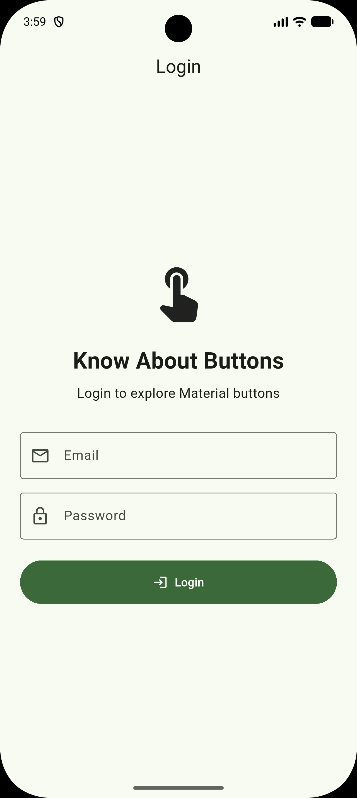
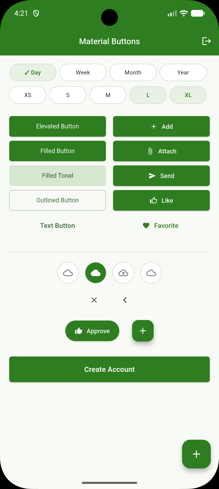

# Flutter Buttons & Navigation

A Flutter mobile application demonstrating different Material Design
button variants and navigation techniques.

## Project Overview

This project was developed as part of a practical Flutter assignment.
It demonstrates:

- Different Material button variants
- Multiple screens
- Navigator.push()
- Navigator.pop()
- Navigator.pushReplacement()
- Named routes
- Icon buttons
- Floating Action Button
- Responsive mobile UI

## Features

### Material Buttons

- Elevated Button
- Filled Button
- Filled Tonal Button
- Outlined Button
- Text Button
- Icon Button
- Floating Action Button
- Buttons with icons
- Custom-styled button

### Navigation

The application demonstrates:

- `Navigator.push()`
- `Navigator.pop()`
- `Navigator.pushReplacement()`
- `Navigator.pushNamed()`

## Screenshots

### Login Screen

### Button Gallery

## Technologies Used

- Flutter
- Dart
- Material Design
- Android Studio
- GitHub

## Author

Supriya Shrestha